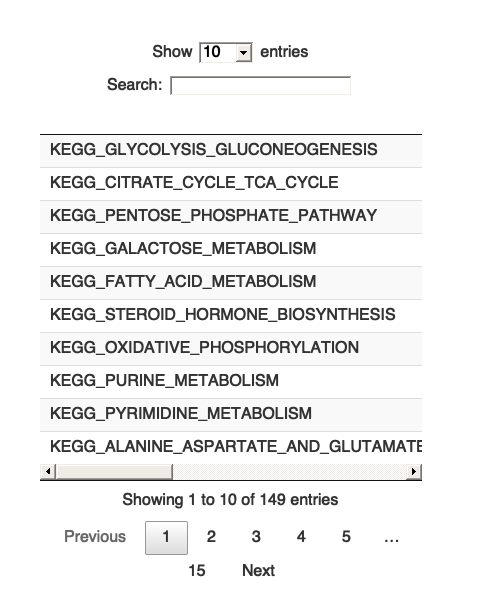
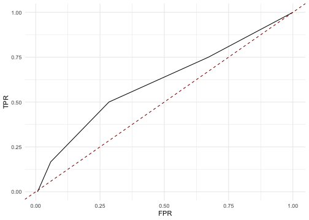
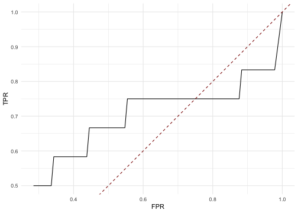
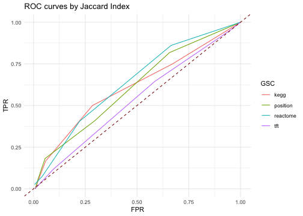

# Overview

Here we present an example of the \texttt{brainClass} workflow to perform transcriptional-data-guided fMRI network classification and the post-hoc evaluation using the COBRE data set. 

# Install `brainClass`


```r
# install.packages('devtools')
devtools::install_github("Mengbo-Li/brainClass")
```


# Load packages


```r
library(tidyverse)
library(brainClass)
library(graphclass)
```

# Load data


```r
data("ahba")
data("gscv7.0")
data("digsee")
data("COBRE.data")
```

- Gene expression data


```r
class(ahba)
[1] "data.frame"
dim(ahba)
[1]   248 19227
ahba[1:5, 1:10]
       7249   51312   54708   56172    151295  254910     7486  643858     4296   55323
1   -0.0559  0.9041  0.2480  0.6225 -0.058305 -0.2234 -0.04350 -0.0687 -0.20332  0.1353
10  -0.0801 -0.1264  0.1999 -0.1327 -0.723591 -0.3544  0.10761  0.2484 -0.22604 -0.0250
100  0.0766  0.0693 -0.0651  0.0465 -0.401925 -0.3309 -0.00106  0.0383 -0.00497 -0.0148
101 -0.1631  0.1146 -0.0210 -0.2545 -0.000259  0.0274 -0.16150 -0.1989  0.57247  0.0365
102  0.3529  0.0731 -0.2145 -0.1050 -0.463868 -0.5105 -0.07380 -0.4077  0.23011 -0.0918
```

- COBRE fMRI network data


```r
X_cobre <- COBRE.data$X.cobre
y_cobre <- COBRE.data$Y.cobre
colnames(X_cobre) <- getEdgeLabel(node = c(1:74, 76:264))
rownames(X_cobre) <- as.character(1:124)
y_cobre[y_cobre == -1] <- 0
table(y_cobre)
y_cobre
 0  1 
70 54 
```

- Gene set collections (GSCs) from MSigDB v7.0

Genes are identified by entrez ID. GSCs are unfiltered. 


```r
length(gscv7.0)
[1] 8
names(gscv7.0)
[1] "position" "kegg"     "reactome" "tft"      "bp"       "cc"       "mf"       "immune"  
length(gscv7.0$kegg)
[1] 186
gscv7.0$kegg[1:3]
$KEGG_GLYCOLYSIS_GLUCONEOGENESIS
 [1] "55902"  "2645"   "5232"   "5230"   "5162"   "5160"   "5161"   "55276"  "7167"   "84532" 
[11] "2203"   "125"    "3099"   "126"    "3098"   "3101"   "127"    "5224"   "128"    "5223"  
[21] "124"    "230"    "501"    "92483"  "5313"   "160287" "2023"   "5315"   "5214"   "669"   
[31] "5106"   "5105"   "219"    "217"    "218"    "10327"  "8789"   "5213"   "5211"   "3948"  
[41] "2597"   "2027"   "2026"   "441531" "131"    "130"    "3945"   "220"    "221"    "222"   
[51] "223"    "224"    "130589" "226"    "1738"   "1737"   "229"    "57818"  "3939"   "2538"  
[61] "5236"   "2821"  

$KEGG_CITRATE_CYCLE_TCA_CYCLE
 [1] "3420"   "1743"   "5106"   "1431"   "5162"   "5105"   "5160"   "5161"   "283398" "2271"  
[11] "6392"   "4967"   "6390"   "3419"   "6391"   "3418"   "3417"   "48"     "47"     "4191"  
[21] "1738"   "4190"   "1737"   "55753"  "5091"   "6389"   "8802"   "8803"   "8801"   "3421"  
[31] "50"    

$KEGG_PENTOSE_PHOSPHATE_PATHWAY
 [1] "6120"   "22934"  "55276"  "25796"  "5634"   "8789"   "5213"   "5211"   "6888"   "7086"  
[11] "2203"   "84076"  "5226"   "64080"  "226"    "230"    "229"    "9563"   "729020" "221823"
[21] "5631"   "51071"  "2539"   "5236"   "8277"   "5214"   "2821"  
```

- DiGSeE scores of GSCs for use in the post-hoc evaluation. 

DiGSeE scores of schizophrenia relevance are constructed for each GSC. GSCs are 
filtered by size. We kept gene sets with at least 5 genes. Further details on 
how we obtained these scores are available in the Supplementary methods to the 
manuscript. 


```r
length(digsee)
[1] 8
names(digsee)
[1] "tft"      "kegg"     "bp"       "cc"       "mf"       "reactome" "position" "immune"  
head(digsee$kegg)
                                    prop sumScore avgScore
KEGG_GLYCOLYSIS_GLUCONEOGENESIS   0.0909    0.965   0.0877
KEGG_CITRATE_CYCLE_TCA_CYCLE      0.0000    0.000   0.0000
KEGG_PENTOSE_PHOSPHATE_PATHWAY    0.2000    0.953   0.1907
KEGG_GALACTOSE_METABOLISM         0.0000    0.000   0.0000
KEGG_FATTY_ACID_METABOLISM        0.2857    1.967   0.2810
KEGG_STEROID_HORMONE_BIOSYNTHESIS 0.2500    2.277   0.2846
```


# `brainClass` network classification

For example, let us use the KEGG pathways to construct gene set expression networks. 

## Obtain gene set edge groups

1) Downsize gene expression data (Optional but recommended)


```r
ahba <- filterGeneExpr(ahba)
ahba <- ahba[rownames(ahba)[order(as.numeric(rownames(ahba)))], 
    ]
ahba <- ahba[-which(rownames(ahba) == "75"), ]
dim(ahba)
[1]  247 4807
```

2) Get a gene set collection (GSC) of interest and filter by gene set sizes 

The filtering on GSC by gene set sizes is optional by recommended. 


```r
kegg <- filterGeneSets(geneSetList = gscv7.0$kegg, candidateGenes = colnames(ahba), 
    min.size = 5, max.size = Inf)
summary(sapply(kegg, length))
   Min. 1st Qu.  Median    Mean 3rd Qu.    Max. 
      5       9      15      21      27     109 
```

If one wishes to keep all gene sets from the GSC, set `min.size` to 2 and `max.size` to Inf. The `min.size` parameter cannot be smaller than 2 in order to calculate correlations. Note that, it is still necessary to filter out genes that do not have gene expression information in the reference transcriptional data set, which is the (filtered) AHBA dataset. 


```r
# Not run
kegg <- filterGeneSets(geneSetList = gscv7.0$kegg, candidateGenes = colnames(ahba), 
    min.size = 2, max.size = Inf)
```


3) Get gene set edge groups


```r
keggEdgeGrp <- getGeneSetEdgeGroup(geneExpr = ahba, geneSetList = kegg, 
    cutoff = 0.99)
```


## Network classification and prediction

Take one fold from one repeat of 10-fold cross validation as an example: 


```r
edgesToClassify <- unlist(keggEdgeGrp)
X_cobre_filterd <- X_cobre[, edgesToClassify[!duplicated(edgesToClassify)]]

set.seed(10)
cvfolds <- getCVfolds(y_cobre, k = 10, repeats = 1)
trainid <- cvfolds[[1]] %>% filter(k != 1)
fit <- brainclass(X = X_cobre_filterd[trainid$Ind, ], y = y_cobre[trainid$Ind], 
    edgeGrp = keggEdgeGrp)
```

Prediction on the test set


```r
testid <- cvfolds[[1]] %>% filter(k == 1)
test <- predict(fit, X = X_cobre_filterd[testid$Ind, ], type = "class")
table(test, y_cobre[testid$Ind])
    
test 0 1
   0 7 0
   1 0 6
```


# Post-hoc Interpretation

## Example 1

First, as an example, we evaluate the edge selection results by *glmnet::glmnet* applied on the COBRE data set by differnt metrics with KEGG pathways. 

(1) Edge selection results by *glmnet*

Obtain the edge labels of selected features, that is, edges with a non-zero fitted coefficient. 


```r
# install.package('glmnet')
library(glmnet)

cvfit <- cv.glmnet(X_cobre, y_cobre, family = "binomial", nfolds = 10)
selectedEdges <- coef(cvfit, s = "lambda.min")
selectedEdges <- names(selectedEdges[selectedEdges@i + 1, ])[-1]
length(selectedEdges)
[1] 86
```

(2) Obtain edgewise metrics

Evaluate by KEGG pathways: 


```r
metrics <- posthoc.edge(selected.edgeLabels = selectedEdges, 
    all.edgeLabels = colnames(X_cobre), geneSetList = kegg, geneExpr = ahba, 
    iter = 100)
DT::datatable(signif(metrics, 2))
```



(3) Association with prior knowledge - the DiGSeE database

Get "truth" - KEGG pathways with a top 5% in both average and sum DiGSeE scores are assumed to be associated with schizophrenia. 


```r
metrics <- merge(metrics, digsee[["kegg"]], by = 0) %>% mutate(truth = ((avgScore >= 
    quantile(avgScore, 0.95)) + (sumScore >= quantile(sumScore, 
    0.95)) > 0) + 0)
table(metrics$truth)

  0   1 
137  12 
metrics$Row.names[metrics$truth == 1]
 [1] "KEGG_ALZHEIMERS_DISEASE"                      "KEGG_AMYOTROPHIC_LATERAL_SCLEROSIS_ALS"      
 [3] "KEGG_ARGININE_AND_PROLINE_METABOLISM"         "KEGG_CALCIUM_SIGNALING_PATHWAY"              
 [5] "KEGG_HUNTINGTONS_DISEASE"                     "KEGG_LINOLEIC_ACID_METABOLISM"               
 [7] "KEGG_LONG_TERM_POTENTIATION"                  "KEGG_MAPK_SIGNALING_PATHWAY"                 
 [9] "KEGG_NEUROACTIVE_LIGAND_RECEPTOR_INTERACTION" "KEGG_PATHWAYS_IN_CANCER"                     
[11] "KEGG_PRION_DISEASES"                          "KEGG_TRYPTOPHAN_METABOLISM"                  
```


Generate the receiver operating characteristic (ROC) curve for each metric: 


```r
rocs <- getROC(truth = metrics$truth, test.metric = metrics$Jaccard, 
    step.size = 0.01)

ggplot(rocs, aes(x = fpr, y = tpr)) + geom_line() + geom_abline(slope = 1, 
    intercept = 0, color = "darkred", linetype = 2) + labs(x = "FPR", 
    y = "TPR") + theme_minimal()
```



Also, calculate the area under this ROC curve (AUC):


```r
DescTools::AUC(rocs$fpr, rocs$tpr)
[1] 0.609
```

Notice that, with p-valued metrics, signigicance is indicated by smaller values. We thereby need the "one-minus" transformation when calcuating the ROC curve: 


```r
rocs <- getROC(truth = metrics$truth, test.metric = 1 - metrics$Jaccard.PValue, 
    step.size = 0.01)

ggplot(rocs, aes(x = fpr, y = tpr)) + geom_line() + geom_abline(slope = 1, 
    intercept = 0, color = "darkred", linetype = 2) + labs(x = "FPR", 
    y = "TPR") + theme_minimal()
```



```r

DescTools::AUC(rocs$fpr, rocs$tpr)
[1] 0.509
```


## Example 2

Next, we evaluate the same selected edges by *glmnet" with the Jaccard index by different GSCs (say, KEGG, REACTOME, transcription factor targets and positional). 


```r
gscs <- c("kegg", "reactome", "position", "tft")
rocs <- lapply(gscs, function(ind) {
    # filter the gene sets by size
    gsc_i <- filterGeneSets(geneSetList = gscv7.0[[ind]], candidateGenes = colnames(ahba), 
        min.size = 5, max.size = Inf)
    # obtain Jaccard indices
    res <- posthoc.edge(selected.edgeLabels = selectedEdges, 
        all.edgeLabels = colnames(X_cobre), geneSetList = gsc_i, 
        geneExpr = ahba, get.jaccard = TRUE, get.betweenness = FALSE, 
        iter = 100)
    # get roc
    res <- merge(res, digsee[[ind]], by = 0) %>% mutate(truth = ((avgScore >= 
        quantile(avgScore, 0.95)) + (sumScore >= quantile(sumScore, 
        0.95)) > 0) + 0)
    roc <- getROC(truth = res$truth, test.metric = res$Jaccard, 
        step.size = 0.01)

    roc$gsc <- ind
    return(roc)
}) %>% do.call(rbind, .)
```

Visualisation: 


```r
ggplot(rocs, aes(x = fpr, y = tpr, color = gsc)) + geom_line() + 
    geom_abline(slope = 1, intercept = 0, color = "darkred", 
        linetype = 2) + labs(x = "FPR", y = "TPR", color = "GSC") + 
    ggtitle("ROC curves by Jaccard Index") + theme_minimal()
```



AUCs:


```r
group_by(rocs, gsc) %>% summarise(auc = DescTools::AUC(fpr, tpr))
# A tibble: 4 x 2
  gsc        auc
  <chr>    <dbl>
1 kegg     0.609
2 position 0.609
3 reactome 0.637
4 tft      0.531
```


# References

Aine, C. J., Bockholt, H. J., Bustillo, J. R., Cañive, J. M., Caprihan, A., Gasparovic, C., ... & Calhoun, V. D. (2017). Multimodal neuroimaging in schizophrenia: description and dissemination. *Neuroinformatics*, 15(4), 343-364.

Hawrylycz, M. J., Lein, E. S., Guillozet-Bongaarts, A. L., Shen, E. H., Ng, L., Miller, J. A., ... & Jones, A. R. (2012). An anatomically comprehensive atlas of the adult human brain transcriptome. *Nature*, 489(7416), 391-399.

Kim, J., So, S., Lee, H. J., Park, J. C., Kim, J. J., & Lee, H. (2013). DigSee: disease gene search engine with evidence sentences (version cancer). *Nucleic acids research*, 41(W1), W510-W517.

Li, M., Kessler, D., Arroyo, J., Freytag, S., Bahlo, M., Levina, E., & Yang, J. Y. H. (2020). Guiding and interpreting brain network classification with transcriptional data. *bioRxiv*.

Liberzon, A., Subramanian, A., Pinchback, R., Thorvaldsdóttir, H., Tamayo, P., & Mesirov, J. P. (2011). Molecular signatures database (MSigDB) 3.0. *Bioinformatics*, 27(12), 1739-1740.

Power, J. D., Cohen, A. L., Nelson, S. M., Wig, G. S., Barnes, K. A., Church, J. A., ... & Petersen, S. E. (2011). Functional network organization of the human brain. *Neuron*, 72(4), 665-678.

Relión, J. D. A., Kessler, D., Levina, E., & Taylor, S. F. (2019). Network classification with applications to brain connectomics. *The annals of applied statistics*, 13(3), 1648. 

Friedman, J., Hastie, T., & Tibshirani, R. (2010). Regularization paths for generalized linear models via coordinate descent. *Journal of statistical software*, 33(1), 1.


# Session Information


```r
sessionInfo()
R version 4.0.5 (2021-03-31)
Platform: x86_64-apple-darwin17.0 (64-bit)
Running under: macOS Catalina 10.15.7

Matrix products: default
BLAS:   /System/Library/Frameworks/Accelerate.framework/Versions/A/Frameworks/vecLib.framework/Versions/A/libBLAS.dylib
LAPACK: /Library/Frameworks/R.framework/Versions/4.0/Resources/lib/libRlapack.dylib

locale:
[1] C/en_AU.UTF-8/en_AU.UTF-8/C/en_AU.UTF-8/en_AU.UTF-8

attached base packages:
[1] stats     graphics  grDevices utils     datasets  methods   base     

other attached packages:
 [1] igraph_1.2.6      DescTools_0.99.40 glmnet_4.1-1      Matrix_1.3-2      graphclass_1.1   
 [6] forcats_0.5.1     stringr_1.4.0     dplyr_1.0.5       purrr_0.3.4       readr_1.4.0      
[11] tidyr_1.1.3       tibble_3.1.0      ggplot2_3.3.3     tidyverse_1.3.0   brainClass_0.1.0 

loaded via a namespace (and not attached):
 [1] colorspace_2.0-0    ellipsis_0.3.1      class_7.3-18        rprojroot_2.0.2    
 [5] fs_1.5.0            gld_2.6.2           rstudioapi_0.13     proxy_0.4-25       
 [9] farver_2.1.0        roxygen2_7.1.1      remotes_2.3.0       cvTools_0.3.2      
[13] DT_0.17             fansi_0.4.2         mvtnorm_1.1-1       lubridate_1.7.10   
[17] xml2_1.3.2          codetools_0.2-18    splines_4.0.5       cachem_1.0.4       
[21] rootSolve_1.8.2.1   robustbase_0.93-7   knitr_1.31          pkgload_1.2.0      
[25] jsonlite_1.7.2      broom_0.7.6         dbplyr_2.1.0        grpregOverlap_2.2-0
[29] compiler_4.0.5      httr_1.4.2          backports_1.2.1     assertthat_0.2.1   
[33] fastmap_1.1.0       cli_2.4.0           formatR_1.8         htmltools_0.5.1.1  
[37] prettyunits_1.1.1   tools_4.0.5         gtable_0.3.0        glue_1.4.2         
[41] lmom_2.8            Rcpp_1.0.6          cellranger_1.1.0    vctrs_0.3.7        
[45] iterators_1.0.13    crosstalk_1.1.1     grpreg_3.3.1        xfun_0.22          
[49] rbibutils_2.0       ps_1.6.0            testthat_3.0.2      rvest_1.0.0        
[53] lifecycle_1.0.0     devtools_2.3.2      DEoptimR_1.0-8      MASS_7.3-53.1      
[57] scales_1.1.1        hms_1.0.0           expm_0.999-6        yaml_2.2.1         
[61] Exact_2.1           memoise_2.0.0       stringi_1.6.1       highr_0.8          
[65] desc_1.3.0          foreach_1.5.1       e1071_1.7-6         boot_1.3-27        
[69] pkgbuild_1.2.0      shape_1.4.5         Rdpack_2.1.1        rlang_0.4.10       
[73] pkgconfig_2.0.3     evaluate_0.14       lattice_0.20-41     labeling_0.4.2     
[77] htmlwidgets_1.5.3   processx_3.5.1      tidyselect_1.1.0    magrittr_2.0.1     
[81] R6_2.5.0            generics_0.1.0      DBI_1.1.1           pillar_1.5.1       
[85] haven_2.3.1         withr_2.4.1         survival_3.2-10     modelr_0.1.8       
[89] crayon_1.4.1        utf8_1.2.1          usethis_2.0.1       grid_4.0.5         
[93] readxl_1.3.1        callr_3.6.0         reprex_2.0.0        digest_0.6.27      
[97] webshot_0.5.2       munsell_0.5.0       sessioninfo_1.1.1  
```

